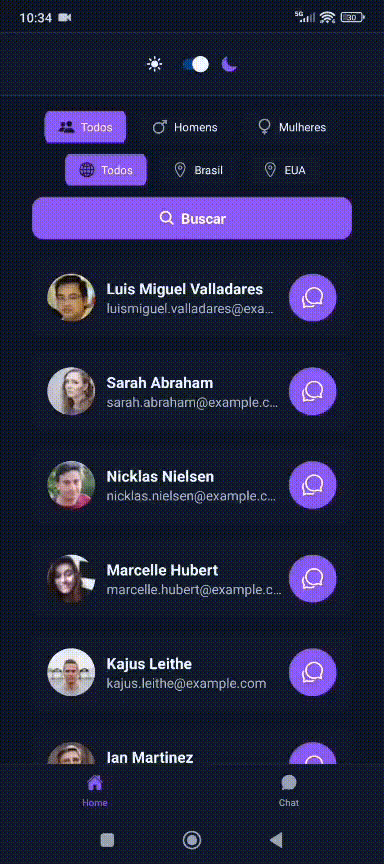

# People App (React Native + Expo)

Aplicação mobile desenvolvida com **React Native (Expo)** que permite explorar, visualizar e interagir com uma lista de usuários consumindo a API pública **Random User**.

O app foi construído com foco em **experiência do usuário, performance e organização de código**.




## 📱 Funcionalidades

### 👥 Lista de Usuários
- Listagem de usuários com `FlatList`
- Paginação (infinite scroll)
- Pull-to-refresh
- Filtros por:
  - Gênero
  - Nacionalidade
- Tratamento de loading e erros
- Navegação para perfil do usuário
- 
- ### 👤 Card de usuário
- Exibição de informações principais:
  - Foto (avatar)
  - Nome completo
  - Email
- Texto com truncamento (`numberOfLines`) para evitar quebra de layout
- Estrutura otimizada para listas grandes
- Ações disponíveis:
  - Clique no card → navega para tela de perfil
  - Botão lateral → acesso direto ao chat com o usuário
- Uso de `React.memo` para evitar re-renderizações desnecessárias
- Uso de `useCallback` para otimização de handlers
- Layout responsivo e reutilizável

### 👤 Perfil do Usuário
- Exibição de:
  - Foto
  - Nome completo
  - Email
  - Telefone / celular
  - Idade e data de nascimento
  - Localização completa
- Layout organizado em grid reutilizável

### 💬 Chat do Usuário

#### 📄 Chat Details (por usuário)
- Cada usuário possui um chat individual
- As mensagens são **filtradas automaticamente pelo id**
- Exibe apenas o histórico da conversa com o usuário selecionado
- Campo de input fixo na parte inferior
- Cada mensagem exibe:
  - Nome
  - Foto
  - Conteúdo
  - Data/hora

#### 📚 Histórico geral de mensagens
- Lista com todas as mensagens enviadas
- Permite enviar mensagens para qualquer usuário
- Seleção de usuário via dropdown 


### 🎨 UI / UX
- Suporte a **tema dark/light**
- Componentes reutilizáveis
- Estados de:
  - Loading
  - EmptyState
  - Error

## 🧠 Decisões Técnicas

- Uso de **Context API** para:
  - Gerenciar usuários globalmente
  - Controlar histórico de chat

- Uso de **FlatList** com otimizações:
  - `getItemLayout`
  - `useCallback`
  - `React.memo`

- Separação de responsabilidades:
  - Componentes reutilizáveis (Card, Input, Button, EmptyState)
  - Helpers (formatação de data)

- Tipagem com **TypeScript** para maior segurança

## 🛠️ Tecnologias Utilizadas

- React Native (Expo SDK 50+)
- TypeScript
- React Navigation
- Axios
- Styled-components
- Context API
- Hooks (useState, useEffect, useCallback, React.memo)

## 📡 API

Os dados são consumidos da API pública:

👉 https://randomuser.me/

---

## ▶️ Como rodar o projeto

1. Clone o repositório

```bash
git clone https://github.com/brenolg/User-Chat-React-Native.git
```
2. Acesse a pasta do projeto
```bash
cd User-Chat-React-Native
```
3. Instale as dependências
```bash
npm install
```
4. Inicie o projeto
```bash
npx expo start
```

5. Execute no dispositivo

Você pode rodar o app de várias formas:

📱 Celular (recomendado)

Instale o app Expo Go

Escaneie o QR Code exibido no terminal com o Expo ou aperte a letra a no terminal e emular com Android Studio
